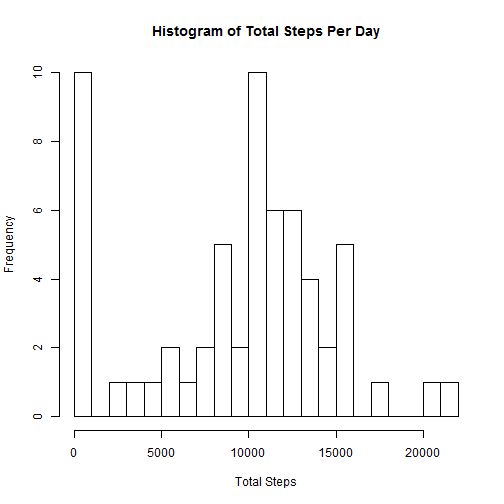
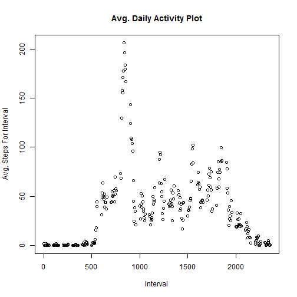
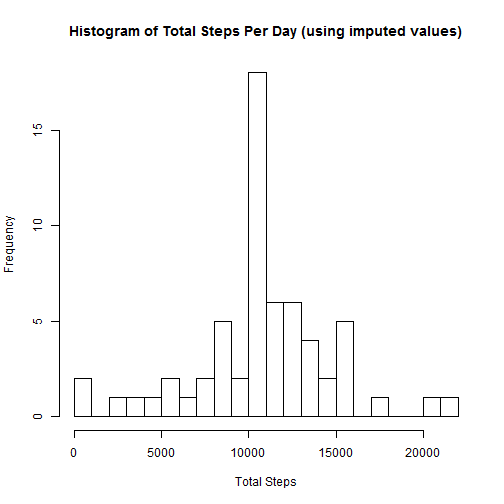
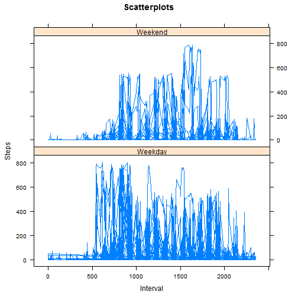

# Loading and preprocessing the data
First unzip the data set.

```r
unzip ("activity.zip")
```

Then read the activity.csv file into R.

```r
act <- read.csv("activity.csv", stringsAsFactors = FALSE)
```

Time do some clean up. The 'date' field has been loaded as a char. Let's convert it to a date.

```r
act[, "date"] <- as.Date(act$date, "%Y-%m-%d")
```


# Total Steps Taken Per Day


```r
library(dplyr)

act_tot_steps_per_day <- act %>% group_by(date) %>% summarise(tot_steps_for_day=sum(steps, na.rm=TRUE))
```

### Histogram of Total Steps Take per Day


```r
hist(act_tot_steps_per_day$tot_steps_for_day, breaks = 30, 
     main = "Histogram of Total Steps Per Day", xlab = "Total Steps")
```

 

### Mean and Median of the Total Number of Steps Taken per Day

The *mean* total number of steps taken per day is 9354.2295082.

The *median* total number of steps taken per day is 10395.

# Average Daily Activity Pattern


```r
library(dplyr)

act_group_by_interval <- act %>% group_by(interval)

result <- act_group_by_interval %>% summarise(avg_steps_taken_for_int=mean(steps, na.rm=TRUE))
with(result, plot(interval, avg_steps_taken_for_int, ylab = "Avg. Steps For Interval", xlab = "Interval", main = "Avg. Daily Activity Plot"))
```

 

```r
max_int <- subset(result, avg_steps_taken_for_int==max(avg_steps_taken_for_int))
```

The 5 minute interval with the **maximum** average number of steps is the **835** interval.

# Imputing Missing Values

### Part 1 - Total Complete Cases in Data Set

The following code will help us identify complete cases in our data set.


```r
act[, "complete_case"] <- complete.cases(act)
act4 <- subset(act, complete.cases(act))
nrow(act4)
```

```
## [1] 15264
```

There are **15264** complete cases.

### Part 2 - Strategy for Filling In Missing Values

To fill in missing values, this report will use the average daily total steps for a given interval. To join the data, the sqldf package will be used.


```r
library(sqldf)
query <- " SELECT a.date, 
              a.interval, 
              a.steps, 
              r.avg_steps_taken_for_int 
          FROM act a 
              LEFT JOIN result r 
                   ON a.interval = r.interval"

new_df <- sqldf(query)
head(new_df)
```

```
##         date interval steps avg_steps_taken_for_int
## 1 2012-10-01        0    NA               1.7169811
## 2 2012-10-01        5    NA               0.3396226
## 3 2012-10-01       10    NA               0.1320755
## 4 2012-10-01       15    NA               0.1509434
## 5 2012-10-01       20    NA               0.0754717
## 6 2012-10-01       25    NA               2.0943396
```

```r
new_df[, "steps"] <- as.numeric(new_df$steps)

new_df[, "is_na"] <- is.na(new_df$steps)

       
for (i in 1:nrow(new_df)) {
  if(is.na(new_df[i, 3])==TRUE) {
   new_df[i, 3] <- new_df[i, "avg_steps_taken_for_int"]
  }
}
                               
print(head(new_df))                               
```

```
##         date interval     steps avg_steps_taken_for_int is_na
## 1 2012-10-01        0 1.7169811               1.7169811  TRUE
## 2 2012-10-01        5 0.3396226               0.3396226  TRUE
## 3 2012-10-01       10 0.1320755               0.1320755  TRUE
## 4 2012-10-01       15 0.1509434               0.1509434  TRUE
## 5 2012-10-01       20 0.0754717               0.0754717  TRUE
## 6 2012-10-01       25 2.0943396               2.0943396  TRUE
```


```r
act_tot_steps_per_day <- new_df %>% group_by(date) %>% summarise(tot_steps_for_day=sum(steps, na.rm=TRUE))
print(act_tot_steps_per_day)
```

```
## Source: local data frame [61 x 2]
## 
##          date tot_steps_for_day
##        (date)             (dbl)
## 1  2012-10-01          10766.19
## 2  2012-10-02            126.00
## 3  2012-10-03          11352.00
## 4  2012-10-04          12116.00
## 5  2012-10-05          13294.00
## 6  2012-10-06          15420.00
## 7  2012-10-07          11015.00
## 8  2012-10-08          10766.19
## 9  2012-10-09          12811.00
## 10 2012-10-10           9900.00
## ..        ...               ...
```


```r
hist(act_tot_steps_per_day$tot_steps_for_day, breaks = 30, 
     main = "Histogram of Total Steps Per Day (using imputed values)", xlab = "Total Steps")
```

 

The **mean** for the dataset, using imputed values, is ...


```r
mean(act_tot_steps_per_day$tot_steps_for_day)
```

```
## [1] 10766.19
```

The **median** for the dataset, using imputed values, is ...

```r
median(act_tot_steps_per_day$tot_steps_for_day)
```

```
## [1] 10766.19
```

Comparing how the total steps per day changes when using imputed values, we note that:

1. The mean and median for the imputed data set is higher.
2. The median for the imputed data set is the same as the mean in the imputed data set.


# Differences in Activity Patterns Between Weekdays and Weekends

Before we can create the the chart, we have to extract the weekday from the date, determine if weekday occurs during the weekend, and create a new factor variable that identifies weekends and weekdays.


```r
new_df$dow <- weekdays(new_df$date)

weekend <- c("Saturday", "Sunday")
weekday <- c("Monday",
             "Tuesday",
             "Wednesday",
             "Thursday",
             "Friday")

# Create empty column to store our results
new_df[, "status"] <- ''


wkend <- new_df$dow %in% weekend
new_df$status[wkend] <- "Weekend"

wkday <- new_df$dow %in% weekday
new_df$status[wkday] <- "Weekday"
```

Now, let's take this data and create a plot of weekend vs weekday activity.


```r
library(lattice)
attach(new_df)
```

```
## The following objects are masked from new_df (pos = 3):
## 
##     avg_steps_taken_for_int, date, dow, interval, is_na, status,
##     steps
## 
## The following objects are masked from new_df (pos = 4):
## 
##     avg_steps_taken_for_int, date, dow, interval, is_na, status,
##     steps
## 
## The following objects are masked from new_df (pos = 13):
## 
##     avg_steps_taken_for_int, date, dow, interval, is_na, status,
##     steps
## 
## The following objects are masked from new_df (pos = 14):
## 
##     avg_steps_taken_for_int, date, dow, interval, is_na, status,
##     steps
## 
## The following objects are masked from new_df (pos = 15):
## 
##     avg_steps_taken_for_int, date, dow, interval, is_na, status,
##     steps
## 
## The following objects are masked from new_df (pos = 16):
## 
##     avg_steps_taken_for_int, date, dow, interval, is_na, status,
##     steps
## 
## The following objects are masked from new_df (pos = 17):
## 
##     avg_steps_taken_for_int, date, dow, interval, is_na, status,
##     steps
## 
## The following objects are masked from new_df (pos = 18):
## 
##     avg_steps_taken_for_int, date, dow, interval, is_na, status,
##     steps
## 
## The following objects are masked from new_df (pos = 19):
## 
##     avg_steps_taken_for_int, date, dow, interval, is_na, status,
##     steps
## 
## The following objects are masked from new_df (pos = 20):
## 
##     avg_steps_taken_for_int, date, dow, interval, is_na, status,
##     steps
## 
## The following objects are masked from new_df (pos = 21):
## 
##     avg_steps_taken_for_int, date, dow, interval, is_na, status,
##     steps
## 
## The following objects are masked from new_df (pos = 22):
## 
##     avg_steps_taken_for_int, date, dow, interval, is_na, status,
##     steps
```

```r
xyplot(steps ~ interval | status, 
  	main="Scatterplots", 
   ylab="Steps", 
   xlab="Interval", 
   t="l", 
   columns=1,
   layout=c(1,2))
```

 


